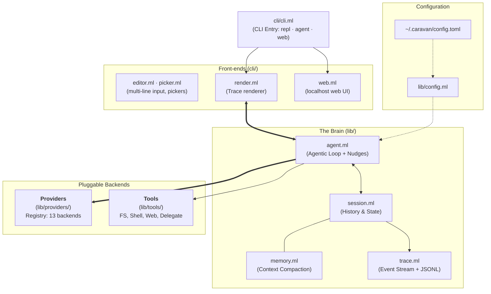

# 🐫 Caravan

**Caravan** is a typed, self-documenting agentic CLI harness and LLM
orchestration framework for OCaml. It gives you a working autonomous agent
out of the box — tools, providers, permissions, transcripts — while staying
light enough for HPC nodes, containers, and non-root environments.

Built on OCaml 5 algebraic effects and Eio. *"Correct, efficient, beautiful."*

**📖 Documentation: [adukhan99.github.io/Caravan](https://adukhan99.github.io/Caravan/)**
(built from [`docs/src/`](docs/src/) — browsable as plain markdown too) ·
[API reference](https://adukhan99.github.io/Caravan/api/)

```
╭─────────────────────────────────╮
│ ☾ C A R A V A N                 │
│ typed agentic harness · OCaml   │
╰─────────────────────────────────╯

❯ /agent summarize the files in this directory
⏺ ls({"path": "."})
  ⎿ # ls .  (cwd: /home/you/project) (+14 lines) [0.0s]
⏺ read_file({"path": "README.md"})
  ⎿ # My Project … (+80 lines) [0.0s]
  ✔ Task finished: The directory contains an OCaml project with…
```

## Highlights

- **Accountable by construction** — every model call, tool call, nudge, and
  summarization is a structured event ([`Caravan.Trace`](lib/trace.ml));
  each session writes an auditable JSONL transcript to `~/.caravan/logs/`.
  No more "what did the agent actually do?"
- **16 providers, one interface** — from a 1B llama on your laptop through
  Groq-hosted 70Bs to Claude, GPT-4o, and Gemini, all behind one config
  file and one registry (`caravan providers`).
- **Free-tier ready** — capability-aware defaults for small and free
  models: text tool-call recovery, token-aware compaction, Retry-After
  handling, cache-stable prompts, and a
  [zero-cost getting-started path](docs/src/free-tier.md) (GitHub Models,
  OpenRouter `:free`, Cerebras, NVIDIA NIM, local Ollama).
- **Real tool permissions** — `auto`, `ask`, or `readonly`: prompt before
  mutating tools or deny them outright for audit-safe agent runs.
- **Scripting-native autonomy** — `caravan agent "task" --json` emits one
  JSON object (result, usage, transcript path) with proper exit codes.
  Built for pipelines, cron, and batch schedulers.
- **Verified TLS** — certificates are checked against the system CA store
  with hostname verification (a rarity in LLM tooling).
- **Hygienic** — one static binary, one 0600 TOML config, no runtime file
  spew, no 10 GB of dependencies. Runs happily non-root.
- **Typed all the way down** — pipelines are `'a -> ('b, string) result`
  functions, tools are first-class modules with typed inputs/outputs,
  providers and memories are packed existentials.
- **A real plugin runtime** — `Caravan.Plugin` implements DeepSeek/PKU's
  spatiotemporal-composability model (the Cordis/dsh foundation):
  components load, unload, and rewire at runtime with tracked, revertible
  effects and reactive typed service injection
  ([docs/src/plugins.md](docs/src/plugins.md)).

---

## Installation

### Requirements

| What | Version | Notes |
|------|---------|-------|
| [opam](https://opam.ocaml.org/doc/Install.html) | ≥ 2.1 | the only hard prerequisite |
| OCaml | ≥ 5.1 | the installer creates a 5.2 switch if you don't have one |
| dune | ≥ 3.21 | installed by opam automatically |
| System libs | — | `libssl-dev`, `libgmp-dev`, `pkg-config` (Debian/Ubuntu names) |

Everything installs into your home directory (`~/.opam`); **no root is
required** at any step, which makes Caravan friendly to clusters and
containers.

### Option 1 — one-liner (recommended)

```bash
curl -fsSL https://raw.githubusercontent.com/adukhan99/Caravan/main/scripts/install.sh | bash
```

The installer is idempotent and does, in order:

1. checks for `opam` (and initializes it if this is a fresh machine);
2. creates an OCaml **5.2** switch if your current switch is older than 5;
3. clones Caravan into `~/.caravan/src` (or updates an existing clone —
   override the location with `CARAVAN_SRC`, the repo with `CARAVAN_REPO`);
4. installs the OCaml dependencies, builds, and `dune install`s the
   `caravan` binary onto opam's `bin` directory (already on your PATH if
   opam is set up; otherwise run `eval "$(opam env)"`).

Then:

```bash
caravan init      # guided setup: provider, model, API key (input hidden)
caravan doctor    # verify config, keys, and endpoint reachability
caravan           # start chatting
```

### Option 2 — manual build

```bash
git clone https://github.com/adukhan99/Caravan.git && cd Caravan
opam install . --deps-only --with-test -y
dune build
dune test                      # full suite, no network required
dune exec caravan -- init
```

### First run: `caravan init`

The wizard walks you through:

1. **Provider** — pick from the 13-entry registry (local entries need no
   key; cloud entries show whether a key is already in your environment);
2. **API key** — if needed and not already exported, entered with **echo
   disabled** and stored under `[api_keys]` in a config written with mode
   **0600**. Environment variables always take precedence and are never
   copied into the file;
3. **Model** — for Ollama the wizard connects and lists your locally
   pulled models to choose from; otherwise the provider's default is
   offered;
4. writes `~/.caravan/config.toml` and prints next steps.

### Upgrading / uninstalling

```bash
# upgrade: re-run the installer (it pulls and rebuilds)
curl -fsSL https://raw.githubusercontent.com/adukhan99/Caravan/main/scripts/install.sh | bash

# uninstall
rm -rf ~/.caravan            # config, logs, sources
opam remove Caravan          # if opam-installed the binary
```

---

## The CLI

```bash
caravan                              # interactive REPL (default)
caravan agent "fix the failing test" # one-shot autonomous run
caravan agent "audit deps" --json    # scripting: one JSON object out
caravan run "…"                      # alias of agent
caravan complete "why is FP useful?" # single completion, no tools
caravan web                          # local web UI on 127.0.0.1:8787
caravan providers                    # provider table + live key status
caravan providers --ladder           # a good model per weight class
caravan models                       # models on the current provider
caravan config set permissions ask   # edit config from the CLI
caravan config get provider          # read a single key
caravan doctor                       # diagnostics (exit 1 on failure)
caravan init                         # setup wizard
```

Every command accepts `-p/--provider`, `-m/--model`, `--base-url`,
`-s/--system`. Settings resolve as:

> **CLI flag → environment (`CARAVAN_*`) → `~/.caravan/config.toml` →
> registry defaults**

### `caravan agent` — autonomy for scripts and schedulers

```bash
caravan agent "profile the hot loop in sim.c and propose a fix" \
    --max-turns 20 --json | jq -r .result
```

- `--max-turns N` — turn budget (default from config, else 10);
- `--quiet` — only the final result on stdout;
- `--json` — a single JSON object: `ok`, `result`, `turns`, `usage`,
  `transcript` (path to the JSONL log of everything that happened);
- exit code `0` on completion, `1` on failure/budget exhaustion, `2` on
  configuration errors — so `&&` chains and Slurm job scripts behave.

Mid-run, the agent receives **budget nudges** at the halfway point and near
exhaustion ("you have used 8 of 10 turns — stay focused on: …"), which
measurably reduces wandering. Disable with `nudge = false`.

### Tool permissions

```toml
permissions = "auto"      # auto | ask | readonly
```

| Mode | Behavior |
|------|----------|
| `auto` | all tools run (default) |
| `ask` | interactive y/n/always prompt before each **mutating** tool |
| `readonly` | mutating tools are denied outright |

Mutating tools: `bash`, `write_file`, `sed`, `touch`, `mkdir`, `delegate`.
Reads, greps, and web lookups are always allowed. Switch live in the REPL
with `/permissions ask`, or per-run with `CARAVAN_PERMISSIONS=readonly`.

### Transcripts

With `transcript = true` (the default), every session appends structured
events to `~/.caravan/logs/session-<timestamp>-<pid>.jsonl`:

```json
{"ts":1786349217.4,"event":"tool_call_start","name":"bash","args":"{\"command\":\"dune test\"}"}
{"ts":1786349219.1,"event":"tool_call_end","name":"bash","output":"…","duration_s":1.7}
{"ts":1786349226.0,"event":"task_finished","summary":"All tests pass after the fix."}
```

`caravan agent --json` returns the transcript path, so a pipeline can
archive exactly what its agent did.

### The web UI

```bash
caravan web [--port 8787]
```

Serves a single, fully embedded page (no assets on disk, no JS toolchain,
no CDN) on **127.0.0.1 only** — a personal cockpit, not a deployment
target. Chat or tick *agent* to run autonomous tasks; every reply shows
the tool calls that produced it, plus token usage.

### REPL slash commands

| Command | Effect |
|---------|--------|
| `/agent <task>` | autonomous loop with tools |
| `/nudge <text>` | queue a steering note, injected before the next model call |
| `/model <name>` · `/models` | switch model / browse and pick |
| `/provider <p> [url]` · `/providers` | switch provider / table with key status |
| `/permissions <mode>` | `auto` \| `ask` \| `readonly`, live |
| `/system [text]` | set or clear the system prompt |
| `/temp` `/top_p` `/top_k` `/max_tokens` `/seed` `/stop` | generation options |
| `/memory <n>` · `/summarise` | context window size / compact now |
| `/history` · `/export [file]` · `/tools` · `/config` | inspect the session |
| `/plugins [enable\|disable <id>]` | plugin composition, live |
| `/help` · `/quit` | you know these |

---

## Providers

Run `caravan providers` for this table with live key detection:

| Name | Kind | Key env var | Default model |
|------|------|-------------|---------------|
| `ollama` | local | — | `llama3.2` |
| `llama_cpp` | local | — | whatever the server loaded |
| `vllm` | local | — | whatever `vllm serve` runs |
| `lmstudio` | local | — | whatever is loaded |
| `openai` | cloud | `OPENAI_API_KEY` | `gpt-4o-mini` |
| `anthropic` | cloud | `ANTHROPIC_API_KEY` | `claude-sonnet-4-5` |
| `groq` | cloud | `GROQ_API_KEY` | `llama-3.3-70b-versatile` |
| `openrouter` | cloud | `OPENROUTER_API_KEY` | `meta-llama/llama-3.3-70b-instruct` |
| `together` | cloud | `TOGETHER_API_KEY` | `Llama-3.3-70B-Instruct-Turbo` |
| `deepseek` | cloud | `DEEPSEEK_API_KEY` | `deepseek-chat` |
| `mistral` | cloud | `MISTRAL_API_KEY` | `mistral-small-latest` |
| `gemini` | cloud | `GEMINI_API_KEY` | `gemini-2.0-flash` |
| `xai` | cloud | `XAI_API_KEY` | `grok-3-mini` |

Aliases work too (`claude` → anthropic, `google` → gemini, `grok` → xai).
Any other OpenAI-compatible endpoint (TGI, llamafile, a lab gateway) works
via `--base-url` with `-p openai`. An unknown provider name is a hard
error listing the valid ones — never a silent fallback.

**A model for every weight class** (`caravan providers --ladder`):

| Class | Suggestion | Note |
|-------|------------|------|
| tiny ~1B | `ollama/llama3.2:1b` | runs on a laptop CPU |
| small ~4B | `ollama/qwen3:4b` | fast local reasoning |
| medium ~20B | `ollama/gpt-oss:20b` | strong local, ~16 GB |
| large ~70B | `groq/llama-3.3-70b-versatile` | open weights, hosted fast |
| frontier | `anthropic/claude-sonnet-4-5` · `openai/gpt-4o` · `gemini/gemini-2.5-pro` | |

Details and caveats: [docs/src/providers.md](docs/src/providers.md).

---

## Configuration

One TOML file: `~/.caravan/config.toml` (or `CARAVAN_CONFIG=/path`).
Written 0600 by `init`; editable with `caravan config set`.

```toml
provider    = "anthropic"
model       = "claude-sonnet-4-5"
system      = "You are a concise research assistant."

stream      = true       # stream tokens as they arrive
max_turns   = 15         # agent turn budget
nudge       = true       # budget-awareness nudges in agent loops
permissions = "ask"      # auto | ask | readonly
transcript  = true       # JSONL session logs in ~/.caravan/logs/
strict_mode = 1          # bash tool: 0 permissive, 1 single-command, 2 hidden

[api_keys]               # env vars take precedence; this is for cron/HPC
anthropic = "sk-ant-…"

[spinner]
enabled  = true          # auto-disabled when stderr is not a TTY
thinking = ["Thinking", "Pondering", "Mulling"]

[[mcp.servers]]          # Model Context Protocol tool servers
name      = "filesystem"
transport = "stdio"
command   = "npx"
args      = ["-y", "@modelcontextprotocol/server-filesystem", "/home/you/ws"]
```

Full reference: [docs/src/configuration.md](docs/src/configuration.md) ·
annotated example: [docs/example_config.toml](docs/example_config.toml).

### Security posture

- TLS certificate + hostname verification against the system CA store
  (`CARAVAN_TLS_INSECURE=1` opts out for self-signed lab endpoints, with a
  loud warning);
- API keys: environment first; the on-disk fallback lives in a 0600 file
  that `caravan doctor` audits;
- the web UI binds loopback only;
- `readonly` permission mode for look-don't-touch agent runs.

---

## Quick Start: The Library

Caravan is also an OCaml library (`Caravan`, `CaravanProviders`,
`CaravanTools`) for building your own typed pipelines and agents:

```ocaml
open Caravan
open Caravan.Chain

let fact_chain net provider =
  (* 1. Define the prompt template *)
  prompt_template "List 3 interesting facts about {{topic}}."

  (* 2. Send to the LLM *)
  |>> llm net provider

  (* 3. Parse the output into a string list *)
  |>> parse Parser.numbered_list

let () = Eio_main.run (fun env ->
  let provider = CaravanProviders.Ollama.make_provider ~model:"llama3.2" () in
  let result = run (fact_chain env#net provider) [("topic", "OCaml")] in
  match result with
  | Ok facts -> List.iter (Printf.printf "- %s\n") facts
  | Error e  -> Printf.eprintf "Error: %s\n" e
)
```

Library features:

- **Typed Chains** — compose pipelines with `|>>` (Result bind), plus
  `parallel`, `retry`, and Kleisli composition;
- **Algebraic Effects** — decoupled tool execution, permission checks, and
  ambient capabilities (`Effects.with_net` hands tools the event loop);
- **Autonomous Agents** — ReAct loops with turn budgets and nudges;
- **Trace** — install a sink and every tool call/reply/summarization is
  yours to render or record (`Trace.jsonl_sink`, `Trace.with_sink`);
- **Subagents** — cold-start, provider-isolated workers plus a `delegate`
  tool for orchestrator models (see the two swarm examples in
  [`examples/`](examples/));
- **Pluggable memory** — sliding window, summary, hierarchical, Redis;
- **Typed parsers & templates** — turn model text into OCaml values;
- **Plugin runtime** — revertible effects, reactive service injection,
  component lifecycles, isolation realms, and declarative reconciliation
  (`Caravan.Plugin`; see the [plugin_system example](examples/plugin_system/)).

## Architecture



- **`Caravan.Types`** — messages, roles, results (wire vs export JSON);
- **`Caravan.Chain`** — the pipeline DSL;
- **`Caravan.Agent`** — autonomous loops;
- **`Caravan.Trace`** — the event stream everything reports into;
- **`Caravan.Tool` / `Caravan.Effects`** — effect-based tool dispatch;
- **`Caravan.Plugin`** — the spatiotemporal-composability plugin runtime;
- **`Caravan.Tls`** — the single, certificate-verifying HTTPS path;
- **`CaravanProviders.Registry`** — the provider table.

## Development

```bash
dune build          # zero warnings expected
dune test           # all offline (mock providers)
dune build @doc     # odoc API docs (needs odoc installed)
```

CI builds and tests on OCaml 5.2 and 5.3
([.github/workflows/ci.yml](.github/workflows/ci.yml)) and checks that
`Caravan.opam` stays in sync with `dune-project`. The composability
backend's design notes and friction log live in
[docs/COMPOSABILITY_NOTES.md](docs/COMPOSABILITY_NOTES.md).

## License

GPL-3.0-or-later
