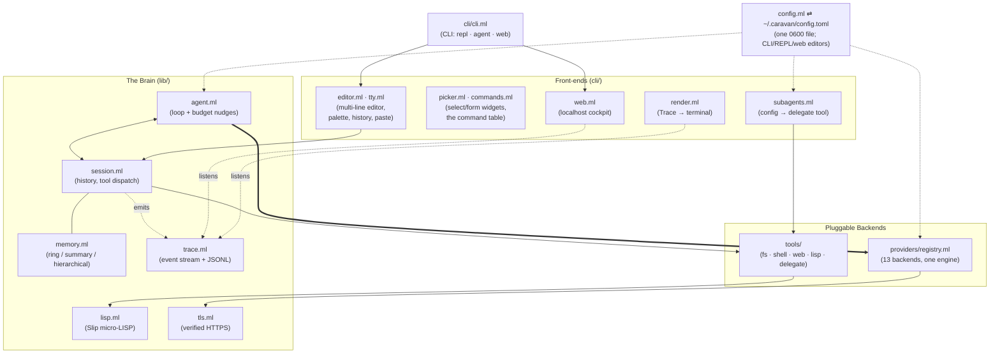

# Architecture

Caravan separates *what happened* (the event stream), *what to do*
(the agent loop), and *how to talk* (providers/tools) — so every layer
can be swapped or observed without touching the others.

## Load-bearing decisions

- **Events, not prints.** `lib/` never writes to the terminal; it emits
  `Trace` events. The CLI renderer, the JSONL transcript, and the web
  audit trail are just sinks. Auditability falls out for free.
- **One wire dialect.** Every provider speaks OpenAI chat-completions
  (Anthropic/Gemini via their official compat endpoints), so one engine
  (`Openai_compatible`) plus a data table (`Registry`) covers 13
  backends. Exotic APIs implement the 4-function `PROVIDER` signature.
- **Effects for capabilities.** Tools request the ambient network with
  the `Get_net` effect; permission checks are the `Ask_permission`
  effect. Front-ends install handlers once; the library stays pure of
  policy.
- **Packed existentials everywhere.** Tools, providers, and memories are
  first-class modules packed with their state — heterogeneous lists with
  full type safety at the boundaries.
- **Totality where models roam.** Slip is step-capped; agent loops are
  turn-budgeted and nudged; the bash tool reports exit codes honestly.
  Nothing a model does can hang the harness.

## Module index

| Module | Role |
|--------|------|
| `Caravan.Types` | messages, roles, results; wire vs export JSON |
| `Caravan.Session` | stateful conversations, tool execution |
| `Caravan.Agent` | autonomous loops, budgets, nudges |
| `Caravan.Trace` | event stream, JSONL transcripts |
| `Caravan.Tool` / `Effects` | typed tools, effect dispatch, permissions |
| `Caravan.Lisp` | the Slip engine |
| `Caravan.Tls` | the single certificate-verifying HTTPS path |
| `Caravan.Memory` / `Redis_store` | context strategies |
| `Caravan.Chain` / `Parser` / `Template` / `Prompt` | the pipeline DSL |
| `CaravanProviders.Registry` | the provider table |
| `CaravanTools.*` | the tool set (auto-registered at build time) |
